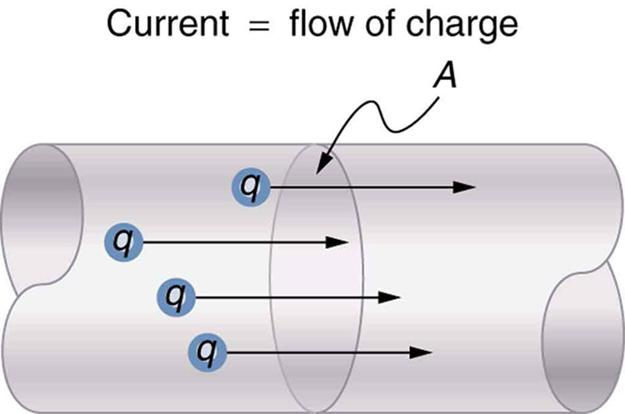

Chapter 1 - The Fundamentals
===============================================

The fundamental unit of electrical charge is the coulomb (C) defined below in units of elementary charge [1]_

.. [1] elementary charge is defined as the electrical charge carried by a single proton

.. math:: 1\ C = \frac{1}{1.602176634 \times 10^{-19} } \ e

The measure of coulombs that cross a infinitely thin cross section of area in a second form the definition of current: the ampere (A)

.. math:: 1 \ A = 1 \ C/s

   Definition of current in terms of charge flow [2]_
   
.. [2]   https://teksguide.org/resource/31-current